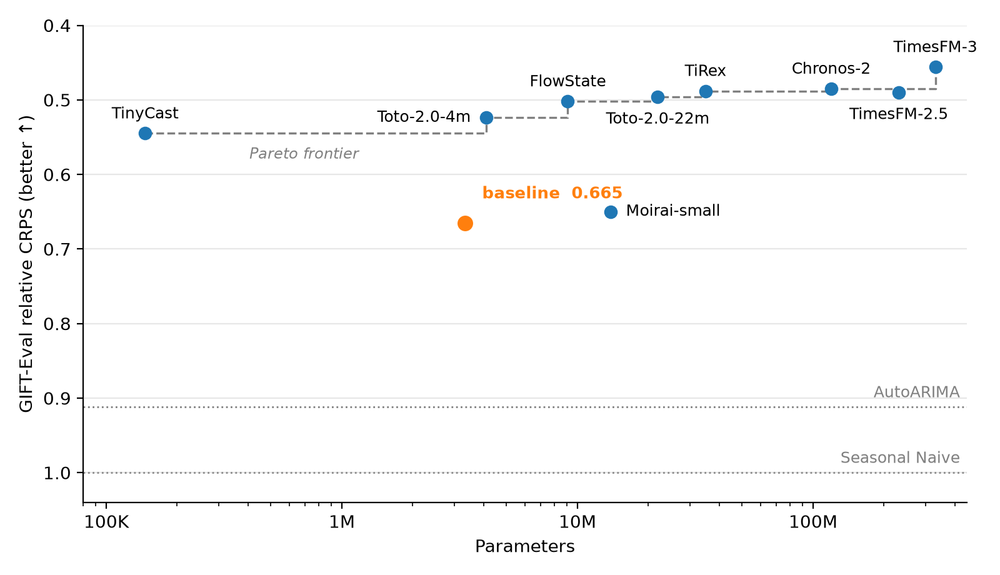

# nanoTSFM

[![Data on Hugging Face][data-badge]][data]
[![Python 3.13][python-badge]][uv]
[![PyTorch][torch-badge]][torch]
[![uv][uv-badge]][uv]
[![License: MIT][license-badge]](LICENSE)

**Train a time-series foundation model on one GPU in two minutes, then make it forecast better.**

nanoTSFM is an open challenge built on a 3.3M-parameter simplified [Toto 2.0][toto2]. It trains on
a 250M-point slice of [GIFT-Eval Pretrain][gep] and is scored zero-shot on [GIFT-Eval][gift], so
results compare directly with the public leaderboard.

## Quick start

Install [uv](https://docs.astral.sh/uv/), then:

```shell
git clone https://github.com/Abel-ai-lab/nanoTSFM && cd nanoTSFM
./run.sh setup           # Python environment
./run.sh data            # GEP-M and the diagnostics from Hugging Face, 730 MB
./run.sh train baseline  # 2 minutes on an A100
./run.sh eval baseline   # GIFT-Eval score, about 4 minutes
```

`./run.sh toy` trains a tiny model on toy data in about 15 seconds on a CPU, to check the setup.
[`quick_start.ipynb`](quick_start.ipynb) walks through data, training,
forecasting and diagnostics. `./run.sh` lists every command.

## Goal

Lower the baseline's GIFT-Eval score with at most one hour of training on one A100 80GB.

- **Score:** GIFT-Eval relative CRPS over 97 tasks from 23 datasets the model never trains on,
  relative to Seasonal Naive and averaged geometrically. Lower is better; 1 matches Seasonal Naive.
- **Data:** any part of GIFT-Eval Pretrain, plus synthetic data your own code generates.
- **Fixed:** the evaluation code and the model's forecast interface.

GEP-Val and GEP-Test, held-out series from the training corpus, are 20-second diagnostics. When they
improve but GIFT-Eval does not, the model is fitting its corpus rather than learning to forecast.
The [rules](docs/rules.md) have the details.

## Leaderboard



Better models sit higher and further left. Orange points are verified [submissions](submissions/),
blue points are published models from the GIFT-Eval leaderboard, the dashed line is the Pareto
frontier, and dotted lines are Seasonal Naive and AutoARIMA. A submission appears once maintainers
have retrained it and recorded the score in [`docs/leaderboard.csv`](docs/leaderboard.csv).

The [baseline](submissions/baseline/) scores 0.666 ± 0.004 CRPS and 0.958 MASE over three seeds
(the figure shows its submitted seed), about 113th of 131 leaderboard models. Toto-2.0-4m, the same
design trained far longer on far more data, shows the headroom. To submit, see
[contributing](CONTRIBUTING.md).

## Data

[abel-lab/nanoTSFM-pretrain][data] holds three slices of GIFT-Eval Pretrain, GEP-S, GEP-M (the
default) and GEP-L:

```python
from datasets import load_dataset

train = load_dataset("abel-lab/nanoTSFM-pretrain", "GEP-M", split="train")
train[0]["target"]  # [variate][time] float32, NaN where a value is missing
```

A training config's `data:` names the slice, or a local parquet folder in the same layout.

## Runtime

The baseline on one A100 80GB with 8 CPU cores:

| Command | Time |
| --- | --- |
| `./run.sh toy` | 15 s, CPU only |
| `./run.sh data` | 1 min, 730 MB |
| `./run.sh train baseline` | 2.5 min: 110 s of training (5,000 steps, 3.4 GB of GPU memory), then GEP-Val |
| `./run.sh test baseline` | 30 s |
| `./run.sh eval baseline` | 4 min, plus a one-time 1 GB download |

## Settings

Nothing needs configuring. To change a default, copy [`.env.example`](.env.example) to `.env`:

| Variable | Default | Use |
| --- | --- | --- |
| `TORCH` | PyPI's build, which needs a CUDA 13 driver | `cuda` for the CUDA 12.8 build, `cpu` for CPU only |
| `HF_HOME` | `~/.cache/huggingface` | where the training data and GIFT-Eval are cached |
| `RUNS` | `runs` | where runs are written |

## Repository

| Path | Contents |
| --- | --- |
| `src/nanotsfm/model.py` | Network, configuration, checkpoints, forecasting |
| `src/nanotsfm/train.py` | Loss, masking, optimization, training clock |
| `src/nanotsfm/data.py` | Loading, window sampling, variate packing |
| `src/nanotsfm/evaluation.py` | GIFT-Eval and GEP scoring (fixed) |
| `run.sh` | Every command |
| `configs/` | Training configurations and the GIFT-Eval task list |
| `scripts/` | The submission check and the leaderboard figure |
| `submissions/` | Submissions, with a template |

The model reads history `[B,V,C]` and series IDs `[B,V]` (equal IDs mark related variates; NaN
marks missing values) and returns nine quantiles `[B,V,H,9]` in original units.

## Documentation

- [Rules](docs/rules.md): score, budget, data, diagnostics.
- [Data](docs/data.md): corpus, split, GEP datasets.
- [Directions](docs/directions.md): improvement ideas by pipeline stage, with pilot results.
- [Submission](docs/submission.md): packaging a result, and how maintainers review it.
- [Contributing](CONTRIBUTING.md): pull request rules.
- [Course](docs/course.md): schedule, final evaluation, awards.
- [To do](docs/todo.md): open work.

## Acknowledgements

The model is based on [Toto 2.0][toto2], and the data and benchmark come from
[GIFT-Eval][gift-paper]. The format is inspired by
[modded-nanogpt](https://github.com/KellerJordan/modded-nanogpt),
[modded-nanotabpfn](https://github.com/borawhocodess/modded-nanotabpfn) and
[nanotabicl](https://github.com/soda-inria/nanotabicl).

[python-badge]: https://img.shields.io/badge/python-3.13-3776AB?logo=python&logoColor=white
[torch-badge]: https://img.shields.io/badge/PyTorch-2.x-EE4C2C?logo=pytorch&logoColor=white
[torch]: https://pytorch.org
[uv-badge]: https://img.shields.io/endpoint?url=https://raw.githubusercontent.com/astral-sh/uv/main/assets/badge/v0.json
[uv]: https://github.com/astral-sh/uv
[license-badge]: https://img.shields.io/badge/license-MIT-2E7A58
[gift]: https://huggingface.co/spaces/Salesforce/GIFT-Eval
[data-badge]: https://img.shields.io/badge/data-nanoTSFM--pretrain-FFD21E?logo=huggingface
[data]: https://huggingface.co/datasets/abel-lab/nanoTSFM-pretrain
[gep]: https://huggingface.co/datasets/Salesforce/GiftEvalPretrain
[toto2]: https://arxiv.org/abs/2605.20119
[gift-paper]: https://arxiv.org/abs/2410.10393
